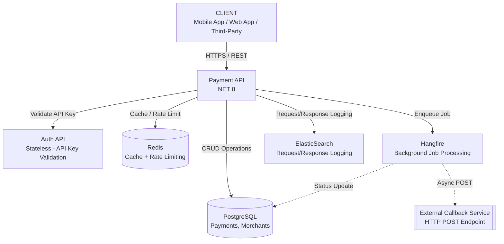
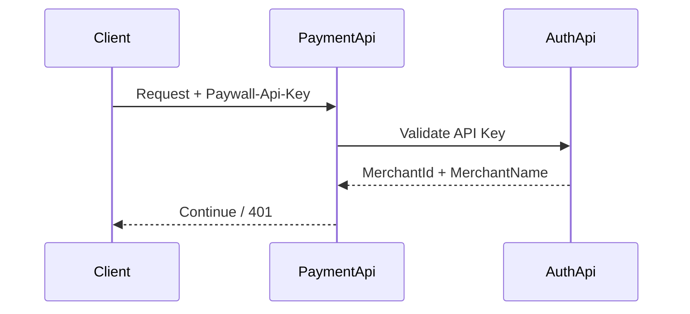
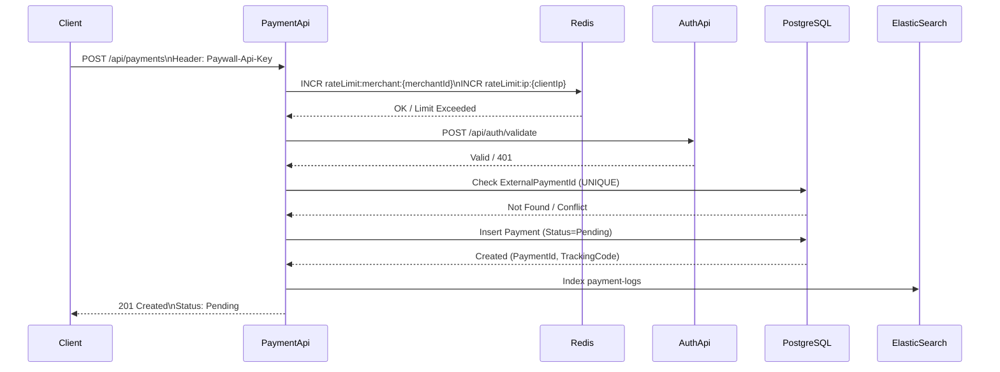
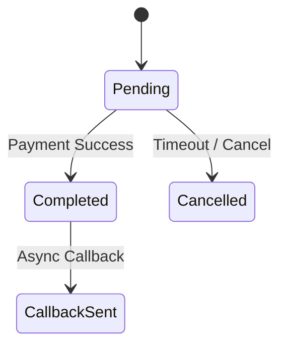
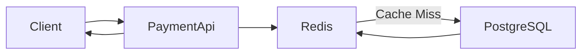

<h1 align="center">
<picture>

</picture>


Paywall Backend Case Project


<a href="#">

</a>
<a href="#">

</a>
<a href="#">

</a>
<a href="#">

</a>
<a href="#">

</a>
<a href="#">

</a>
</h1>

<p align="center">
<em><b>Paywall</b>, farklı merchant'ların tek bir merkezi altyapı üzerinden güvenli ve izlenebilir biçimde ödeme kabul etmesini sağlayan bir <b>Payment Orchestration</b> sistemidir. Clean Architecture ve CQRS pattern kullanılarak geliştirilmiş bu proje; <b>AuthApi</b> ve <b>PaymentApi</b> olmak üzere iki ana servisten oluşur.</em>
</p>


## 📑 Table of Contents

- [Quick Start](#-quick-start)
- [Project Structure](#-project-structure)
- [API Endpoints](#-api-endpoints)
- [Architecture](#-architecture)
- [Authentication Flow](#-authentication-flow)
- [Payment Flows](#-payment-flows)
- [Technologies](#-technologies)
- [Docker Compose](#-docker-compose)
- [Test Scenarios](#-test-scenarios)

---

## ⚙️ Quick Start

### Prerequisites

- [.NET 8 SDK](https://dotnet.microsoft.com/download/dotnet/8.0)
- [Docker Desktop](https://www.docker.com/products/docker-desktop)
- [Git](https://git-scm.com/)

### 1. Clone Repository

```bash
git clone https://github.com/yelizozkan/paywall-payment-system.git
cd paywall-payment-system
```

### 2. Start Infrastructure (Docker)

```bash
docker-compose up -d postgres redis elasticsearch
```

### 3. Apply Database Migrations

```bash
cd src/Paywall.Payment/Paywall.Payment.Infrastructure
dotnet ef database update --startup-project ../Paywall.PaymentApi
```

### 4. Run Services

**Option A: Visual Studio**
- Open `Paywall.sln`
- Set Multiple Startup Projects (AuthApi + PaymentApi)
- Press F5

**Option B: Terminal**

```bash
# Terminal 1 - AuthApi
cd src/Paywall.AuthApi
dotnet run

# Terminal 2 - PaymentApi
cd src/Paywall.Payment/Paywall.PaymentApi
dotnet run
```

### 5. Access Swagger UI

| Service | URL |
|---------|-----|
| AuthApi | https://localhost:7218/swagger |
| PaymentApi | https://localhost:7027/swagger |
| Hangfire Dashboard | https://localhost:7027/hangfire |

---

 

## 💡 Technical Analysis (Aşama 1)
**📖 Overview**

Bu proje, sadeleştirilmiş bir ödeme işleme altyapısının analiz edilmesi, mimarisinin tasarlanması ve geliştirilmesi amacıyla hazırlanmıştır.

Sistem iki ayrı servis olarak tasarlanmıştır:

**AuthApi →** Merchant doğrulama servisi (stateless)

**PaymentApi →** Ödeme işleme ve sorgulama servisi

PaymentApi, gelen her istekte AuthApi’ye doğrulama çağrısı yaparak merchant bilgisini alır ve yalnızca geçerli istekleri işleme alır.

Bu tasarımın amacı:

Servis sorumluluklarını ayırmak

Authentication ile business logic’i izole etmek

Production senaryosunda yatay ölçeklenebilirliği kolaylaştırmak

<br>
<br>

**Architecture Summary**

<div align="center">

| Component     | Responsibility          | Scaling Strategy       |
| ------------- | ----------------------- | ---------------------- |
| AuthApi       | API Key doğrulama       | Stateless – Horizontal |
| PaymentApi    | Payment işlemleri       | Horizontal             |
| PostgreSQL    | Transactional Data      | Read Replica           |
| Redis         | Cache + Rate Limit      | Distributed            |
| Hangfire      | Background Jobs         | Worker Scaling         |
| ElasticSearch | Logging & Observability | Cluster                |
</div>

<br>
<br>

## 🏗 High-Level Architecture



<br>
<br>

## 🏗 Architectural Rationale (Mimari Yaklaşım)

Bu mimari aşağıdaki mühendislik prensipleri doğrultusunda tasarlanmıştır:

<br>
<br>

### • Separation of Concerns (Sorumlulukların Ayrılması)

- Authentication mekanizması business logic’ten izole edilmiştir.
- Cross-cutting concern’ler (logging, rate limiting, exception handling) middleware katmanında ele alınmıştır.
- Payment işlemleri yalnızca transactional domain logic’e odaklanmaktadır.

Amaç: Kodun sürdürülebilir, test edilebilir ve genişletilebilir olması.

---

### • Transactional Integrity (İşlemsel Tutarlılık)

- PostgreSQL sistemin tek doğruluk kaynağıdır (Single Source of Truth).
- Payment state değişimleri ACID garantisi altında gerçekleştirilir.
- `ExternalPaymentId` için UNIQUE constraint uygulanarak idempotency sağlanmıştır.

Amaç: Çift ödeme oluşturulmasının ve veri tutarsızlığının önlenmesi.

---

### • Scalability (Ölçeklenebilirlik)

- AuthApi stateless tasarlanmıştır.
- PaymentApi yatay ölçeklenebilir yapıdadır.
- Redis dağıtık cache ve rate limiting için kullanılmıştır.
- Hangfire worker sayısı artırılarak background job’lar ölçeklenebilir hale getirilmiştir.

Amaç: Artan trafik altında sistem performansının korunması.

---

### • Observability (Gözlemlenebilirlik)

- Structured logging uygulanmıştır.
- Request/Response logları ElasticSearch’e gönderilmektedir.
- PaymentId ve MerchantId üzerinden izlenebilirlik sağlanmıştır.

Amaç: Production ortamında hızlı hata analizi ve performans takibi.

---

### • Resilience (Dayanıklılık)

- Background job’larda retry mekanizması aktiftir.
- Timeout’a düşen `Pending` ödemeler otomatik olarak `Cancelled` durumuna alınır.
- Rate limiting ile kötüye kullanım engellenir.

Amaç: Sistem stabilitesinin korunması.


---

<br>
<br>

# 🔐 3. Authentication Flow


---

<div align="center">
    
### 🔎 Authentication Validation Steps

| Step | Action | Success Result | Failure Result |
|------|--------|---------------|----------------|
| 1 | Extract `Paywall-Api-Key` from Header | Continue | 401 Unauthorized |
| 2 | Validate API Key via AuthApi | Merchant context loaded | 401 Unauthorized |
| 3 | Inject MerchantId into Request Context | Request proceeds | - |

✔ AuthApi stateless tasarlanmıştır
✔ Session veya memory state tutulmaz
</div>

<br>
<br>

# 💳 4.Payment Creation Flow


---

### 1.Payment Creation Steps

<div align="center">

### 🔎 Payment Processing Steps

| Step | Action | Success Result | Failure Result |
|------|--------|---------------|----------------|
| 1 | Receive POST `/api/payments` | Continue | - |
| 2 | Increment rate limit counters (Redis) | Continue | 429 Too Many Requests |
| 3 | Validate `Paywall-Api-Key` via AuthApi | Merchant context loaded | 401 Unauthorized |
| 4 | Check `ExternalPaymentId` uniqueness | Continue | 409 Conflict |
| 5 | Insert Payment (Status = Pending) | Payment created | - |
| 6 | Log request/response to ElasticSearch | Log stored | Logging failure does not block |
| 7 | Return response | 201 Created | - |

</div>

<br>
<br>

 ### 2.Failure Scenarios

<div align="center">

### 🚨 Failure Cases

| Scenario | HTTP Status |
|----------|------------|
| Rate limit exceeded | 429 |
| Invalid API key | 401 |
| Duplicate ExternalPaymentId | 409 |

</div>

<br>
<br>

### 3.Design Guarantees


### 🔐 Design Guarantees

- Rate limiting doğrulama öncesinde uygulanır (kötüye kullanım önlenir)
- API doğrulaması stateless’tir
- `ExternalPaymentId` veritabanı seviyesinde UNIQUE constraint ile korunur
- Başlangıç ödeme durumu her zaman `Pending` olarak atanır
- Logging işlemi business akışını bloklamaz


<br>
<br>

---

# 🔄 5. Payment State Lifecycle


<div align="center">

### 🔄 Durum Geçiş Kuralları

| From | To | Koşul |
|------|----|--------|
| Pending | Completed | Başarılı ödeme sonucu |
| Pending | Cancelled | Timeout (>30dk) veya manuel iptal |
| Completed | CallbackSent | Callback job başarıyla tamamlandı |

Geçersiz geçişler engellenmiştir (örneğin Completed → Pending mümkün değildir).

</div>

<br>
<br>

### 🛑 Geçersiz Geçiş Koruması

- Durum değişimleri kontrollüdür.
- State transition işlemleri atomic olarak gerçekleştirilir.
- Aynı anda iki farklı güncelleme yapılması engellenir.

<br>
<br>

### ⚙️ Concurrency Kontrolü

- Status güncellemeleri optimistic locking prensibine uygundur.
- Tekil payment kaydı üzerinden deterministik geçiş sağlanır.
- Çift tamamlama (double completion) engellenmiştir.

<br>
<br>



<br>
<br>

### 🧾 İş Kuralları Garantisi

- Bir ödeme yalnızca bir kez `Completed` olabilir.
- `Cancelled` durumuna geçmiş bir ödeme tekrar aktif hale getirilemez.
- Callback yalnızca `Completed` durumundan sonra tetiklenir.


---

# 🔍 6. Payment Query Flow (Cache-Aware)


Payment sorguları öncelikle Redis cache üzerinden karşılanır. Cache miss durumunda veri PostgreSQL’den okunur ve tekrar cache’e yazılarak sonraki istekler için performans optimizasyonu sağlanır.


<div align="center">

**Query Implementation Strategy**


| Query Type        | Implementation |
| ----------------- | -------------- |
| TrackingCode      | LINQ           |
| ExternalPaymentId | Raw SQL        |

</div>


# 🚦 7. Rate Limiting Strategy
<div align="center">

| Type           | Key        | Implementation |
| -------------- | ---------- | -------------- |
| Merchant-based | merchantId | Redis counter  |
| IP-based       | IP Address | Redis counter  |

</div>

Rate limiting, kötüye kullanım ve sistem yükünü kontrol etmek amacıyla Redis üzerinde atomic sayaç mantığı ile uygulanmıştır.

# 🛡 10. Middleware Architecture

PaymentApi Middleware Pipeline:
<div align="center">
    
| Middleware         | Purpose                  |
| ------------------ | ------------------------ |
| Authentication     | API key validation       |
| Exception Handling | Global error handling    |
| Rate Limiting      | Abuse protection         |
| Logging            | Request/Response logging |
| Response Wrapper   | Standard output          |

</div>

Middleware katmanı cross-cutting concern’leri business logic’ten ayırarak temiz ve sürdürülebilir bir mimari sağlar.

---

# 🏭 11. Production Enhancements
<div align="center">
    
| Area        | Improvement          |
| ----------- | -------------------- |
| Security    | API Gateway, mTLS    |
| Scalability | Kubernetes           |
| Reliability | Circuit Breaker      |
| Consistency | Outbox Pattern       |
| Monitoring  | Prometheus + Grafana |
</div>

---

## 🏭 Production Ortamı Değerlendirmeleri

<br>
<br>

### 🔐 Güvenlik (Security)

Production ortamında güvenlik, servisler arası iletişimden credential yönetimine kadar çok katmanlı olarak ele alınmalıdır.

<div align="center">

| Önlem | Açıklama | Amaç |
|-------|----------|------|
| API Gateway | Rate limiting, IP filtering, WAF | Dış saldırıları engellemek |
| mTLS | Servisler arası şifreli iletişim | Internal güvenliği artırmak |
| Secret Management | Vault / Secret Manager kullanımı | Credential güvenliği |
| API Key Rotation | Anahtarların periyodik yenilenmesi | Anahtar sızıntısı riskini azaltmak |
| Request Signature | Callback doğrulama | Sahte callback’i engellemek |


</div>

---

### 📈 Ölçeklenebilirlik (Scalability)

Sistem, artan trafik altında performans kaybı yaşamadan yatay olarak ölçeklenebilir şekilde tasarlanmalıdır.

<div align="center">


| Yaklaşım | Açıklama | Amaç |
|----------|----------|------|
| Horizontal Scaling | PaymentApi & AuthApi çoğaltılabilir | Trafik artışına dayanıklılık |
| Kubernetes | Container orchestration | Otomatik ölçekleme |
| Redis Cluster | Dağıtık cache | Yük altında performans |
| PostgreSQL Read Replica | Okuma yükünü dağıtmak | DB performansını artırmak |
| Worker Scaling | Hangfire worker sayısını artırmak | Arka plan işlerini hızlandırmak |

</div>

---

### 🧱 Dayanıklılık (Resilience)

Bağımlı servis hatalarında sistemin tamamen çökmesini engellemek için hata tolerans mekanizmaları uygulanmalıdır.

<div align="center">

| Mekanizma | Açıklama | Amaç |
|------------|----------|------|
| Circuit Breaker | Bağımlı servis arızasında devre kesme | Zincirleme hatayı önlemek |
| Retry Policy | Exponential backoff | Geçici hataları tolere etmek |
| Timeout Policy | Maksimum bekleme süresi | Sistem bloklanmasını önlemek |
| Health Checks | Servis sağlık kontrolleri | Otomatik restart / failover |

</div>

---

### 📊 Gözlemlenebilirlik (Observability)

Production ortamında hataların hızlı tespiti ve performans analizi için ölçülebilir ve izlenebilir bir yapı kurulmalıdır.

<div align="center">

| Bileşen | Açıklama | Amaç |
|----------|----------|------|
| Structured Logging | JSON format log | Kolay analiz |
| Centralized Logging | ElasticSearch cluster | Tek noktadan log takibi |
| Distributed Tracing | OpenTelemetry | Request izleme |
| Metrics | Prometheus | Performans ölçümü |
| Alerting | Grafana | Anlık hata bildirimi |

</div>

---

### 🧾 Veri Tutarlılığı (Data Consistency)

Ödeme gibi kritik domain’lerde veri tutarlılığı deterministik ve kontrollü state geçişleri ile sağlanmalıdır.

<div align="center">

| Strateji | Açıklama | Amaç |
|----------|----------|------|
| Outbox Pattern | Event güvenli publish | Event kaybını önlemek |
| Idempotent Endpoint | Aynı isteğin tekrarında güvenli işlem | Çift ödeme önleme |
| Optimistic Concurrency | Version kontrolü | Çakışma önleme |
| Transaction Boundary | Net transaction scope | Tutarlı veri yönetimi |

</div>


---

### ⚙️ Performans

Düşük gecikme süresi ve yüksek throughput için cache, indeks ve bağlantı optimizasyonları uygulanmalıdır.

<div align="center">

| Optimizasyon | Açıklama | Amaç |
|--------------|----------|------|
| Redis TTL | Cache süresi yönetimi | Gereksiz DB yükünü azaltmak |
| Index Optimization | ExternalPaymentId & TrackingCode index | Hızlı sorgu |
| Connection Pooling | DB bağlantı yönetimi | Resource verimliliği |
| Async I/O | Asenkron işlem | Yüksek throughput |

</div>


---

### 🚦 Rate Limiting & Abuse Prevention

Kötüye kullanım ve ani trafik artışlarına karşı sistem korunmalı ve adil kullanım sağlanmalıdır.

<div align="center">

| Tür | Açıklama | Amaç |
|-----|----------|------|
| Merchant Bazlı | Merchant başına limit | Adil kullanım |
| IP Bazlı | IP başına limit | Bot saldırılarını önlemek |
| Sliding Window | Zamana dayalı limit | Burst kontrolü |
| Global Limit | Sistem genel limiti | Stabilite |

</div>

---

### 🔄 CI/CD & Deployment

Deployment süreçleri otomatikleştirilerek kesintisiz ve güvenli sürüm geçişi sağlanmalıdır.

<div align="center">

| Uygulama | Açıklama | Amaç |
|----------|----------|------|
| Docker | Containerization | Taşınabilirlik |
| Blue-Green Deployment | Paralel release | Zero downtime |
| Rolling Updates | Kademeli geçiş | Servis kesintisini önlemek |
| Automated Migration | Migration kontrolü | Veri tutarlılığı |

</div>

---

### 📦 Disaster Recovery

Olası veri kaybı veya sistem arızalarında hızlı kurtarma için yedekleme ve failover stratejileri uygulanmalıdır.

<div align="center">

| Strateji | Açıklama | Amaç |
|----------|----------|------|
| Günlük Backup | Otomatik yedekleme | Veri kaybını azaltmak |
| Point-in-Time Recovery | Belirli zamana dönme | Hızlı kurtarma |
| Multi-Zone Deployment | Farklı availability zone | Yüksek erişilebilirlik |
| Failover | Otomatik yedek sisteme geçiş | Süreklilik |

</div>

---

# 🎯 13. Engineering Decisions Summary


Bu bölüm, mimari seçimlerin performans, ölçeklenebilirlik, güvenlik ve veri tutarlılığı açısından neden tercih edildiğini özetler. 
Alınan kararlar, minimal gereksinimlerin ötesinde production-ready bir sistem hedefiyle şekillendirilmiştir.

<div align="center">
    
| Concern       | Approach          |
| ------------- | ----------------- |
| Idempotency   | Unique constraint |
| Scalability   | Stateless auth    |
| Performance   | Redis cache       |
| Observability | ElasticSearch     |
| Reliability   | Hangfire retry    |

</div>

---

## 📝 Sonuç

Bu sistem, ödeme işlemlerinin güvenli, tutarlı ve ölçeklenebilir şekilde yönetilebilmesi amacıyla tasarlanmıştır. 
Minimal gereksinimlerin ötesinde production ortamı senaryoları düşünülmüş, 
observability ve resilience prensipleri uygulanmıştır.

Mimari tercihler, deterministik state yönetimi ve idempotent işlem garantisi üzerine kuruludur.
