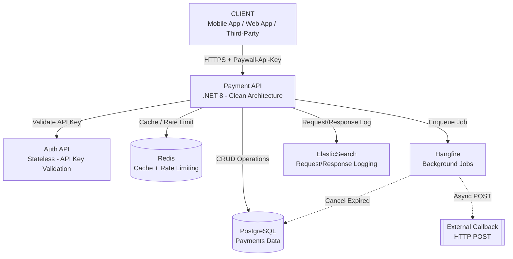
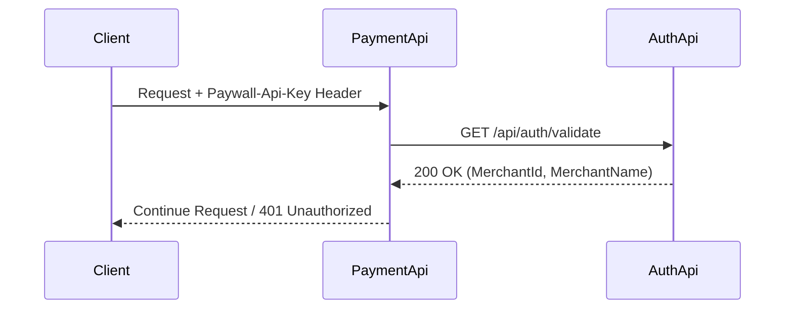
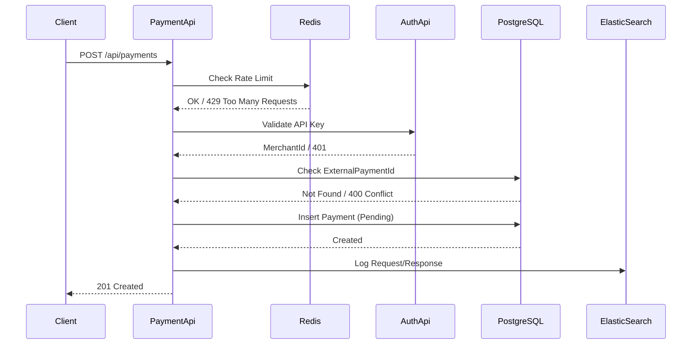
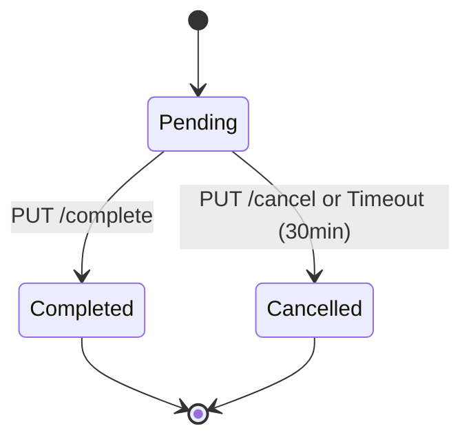

<h1 align="center">
<picture>

</picture>


Paywall Backend Case Project


<a href="#">

</a>
<a href="#">

</a>
<a href="#">

</a>
<a href="#">

</a>
<a href="#">

</a>
<a href="#">

</a>
</h1>

<p align="center">
<em><b>Paywall</b>, farklı merchant'ların tek bir merkezi altyapı üzerinden güvenli ve izlenebilir biçimde ödeme kabul etmesini sağlayan bir <b>Payment Orchestration</b> sistemidir. Clean Architecture ve CQRS pattern kullanılarak geliştirilmiş bu proje; <b>AuthApi</b> ve <b>PaymentApi</b> olmak üzere iki ana servisten oluşur.</em>
</p>


## 📑 Table of Contents

- [Quick Start](#-quick-start)
- [Project Structure](#-project-structure)
- [API Endpoints](#-api-endpoints)
- [Architecture](#-architecture)
- [Authentication Flow](#-authentication-flow)
- [Payment Flows](#-payment-flows)
- [Technologies](#-technologies)
- [Docker Compose](#-docker-compose)
- [Test Scenarios](#-test-scenarios)

---
<br>
## 📖 Overview

Bu proje, sadeleştirilmiş bir ödeme işleme altyapısının analiz edilmesi, mimarisinin tasarlanması ve geliştirilmesi amacıyla hazırlanmıştır.

Sistem iki ayrı servis olarak tasarlanmıştır:

| Servis | Sorumluluk |
|--------|------------|
| **AuthApi** | Merchant doğrulama servisi (stateless) |
| **PaymentApi** | Ödeme işleme ve sorgulama servisi |

PaymentApi, gelen her istekte AuthApi'ye doğrulama çağrısı yaparak merchant bilgisini alır ve yalnızca geçerli istekleri işleme alır.

### Bu Tasarımın Amacı

- **Separation of Concerns:** Servis sorumluluklarını ayırmak
- **Isolation:** Authentication ile business logic'i izole etmek
- **Scalability:** Production senaryosunda yatay ölçeklenebilirliği kolaylaştırmak

<br>

## ⚙️ Quick Start

### 1. Repository'yi Klonlayın

```bash
git clone https://github.com/yelizozkan/paywall-payment-system.git
cd paywall-payment-system
```

### 2. Docker ile Altyapıyı Başlatın

Aşağıdaki komut PostgreSQL, Redis ve ElasticSearch servislerini ayağa kaldırır:

```bash
docker-compose up -d postgres redis elasticsearch
```

### 3. Veritabanı Migration'ını Uygulayın

```bash
cd src/Paywall.Payment/Paywall.Payment.Infrastructure
dotnet ef database update --startup-project ../Paywall.PaymentApi
```

### 4. Servisleri Çalıştırın

**Visual Studio ile:**
- `Paywall.sln` dosyasını açın
- Multiple Startup Projects ayarlayın (AuthApi + PaymentApi)
- F5 ile çalıştırın

**Terminal ile:**

```bash
# Terminal 1 - AuthApi
cd src/Paywall.AuthApi
dotnet run

# Terminal 2 - PaymentApi
cd src/Paywall.Payment/Paywall.PaymentApi
dotnet run
```

### 5. Swagger UI'a Erişin

| Servis | URL |
|--------|-----|
| AuthApi | https://localhost:7218/swagger |
| PaymentApi | https://localhost:7027/swagger |
| Hangfire Dashboard | https://localhost:7027/hangfire |

---

<div align="center">

## 🔌 API Endpoints

### AuthApi

| Method | Endpoint | Açıklama | Auth |
|--------|----------|----------|------|
| GET | `/api/auth/validate` | API Key doğrulama | Paywall-Api-Key |


### PaymentApi

| Method | Endpoint | Açıklama | Auth |
|--------|----------|----------|------|
| POST | `/api/payments` | Yeni ödeme oluştur | Paywall-Api-Key |
| GET | `/api/payments/{id}` | ID ile ödeme sorgula | Paywall-Api-Key |
| GET | `/api/payments/by-tracking/{trackingCode}` | TrackingCode ile sorgula (LINQ) | Paywall-Api-Key |
| GET | `/api/payments/by-external/{externalPaymentId}` | ExternalPaymentId ile sorgula (Raw SQL) | Paywall-Api-Key |
| GET | `/api/payments` | Ödemeleri listele (Paginated) | Paywall-Api-Key |
| PUT | `/api/payments/{id}/complete` | Ödemeyi tamamla | Paywall-Api-Key |
| PUT | `/api/payments/{id}/cancel` | Ödemeyi iptal et | Paywall-Api-Key |

</div>


<br>


## 🏗 Architecture

### High-Level Architecture




### Clean Architecture Layers


```
┌─────────────────────────────────────────────────────────┐
│                    PaymentApi                           │
│              (Controllers, Middlewares)                 │
├─────────────────────────────────────────────────────────┤
│                    Application                          │
│         (CQRS Commands/Queries, DTOs, Validators)       │
├─────────────────────────────────────────────────────────┤
│                      Domain                             │
│            (Entities, Enums, Interfaces)                │
├─────────────────────────────────────────────────────────┤
│                   Infrastructure                        │
│    (EF Core, Redis, Hangfire, ElasticSearch, AuthApi)   │
└─────────────────────────────────────────────────────────┘
```


<div align="center">

### Component Summary

| Component | Responsibility | Scaling Strategy |
|-----------|----------------|------------------|
| AuthApi | API Key validation | Stateless – Horizontal |
| PaymentApi | Payment operations | Horizontal |
| PostgreSQL | Transactional data | Read Replica |
| Redis | Cache + Rate Limit | Distributed |
| Hangfire | Background Jobs | Worker Scaling |
| ElasticSearch | Logging | Cluster |

---

</div>

<br>
<br>


## 🔐 Authentication Flow




<div align="center">
 
### 🔎 Authentication Steps

| Step | Action | Success | Failure |
|------|--------|---------|---------|
| 1 | Extract `Paywall-Api-Key` from Header | Continue | 401 (5002) |
| 2 | Validate via AuthApi | MerchantId loaded | 401 (5001) |
| 3 | Inject MerchantId into Context | Request proceeds | - |

---


<br>
<br>


## 💳 Payment Flows

### Payment Creation




### Payment State Lifecycle




| From | To | Trigger |
|------|----|---------|
| Pending | Completed | Manual completion |
| Pending | Cancelled | Manual cancel or 30min timeout (Hangfire) |

---


<br>
<br>


## 🧪 Test Scenarios

### ✅ Success Cases

| # | Test | Expected |
|---|------|----------|
| 1 | Valid API Key (AuthApi) | 200 + MerchantId |
| 2 | Create Payment | 201 Created |
| 3 | Get Payment by ID | 200 + Payment |
| 4 | Get by TrackingCode | 200 + Payment |
| 5 | Get by ExternalPaymentId | 200 + Payment |
| 6 | List Payments | 200 + Paginated List |
| 7 | Complete Payment | 200 + Status=Completed |
| 8 | Cancel Payment | 200 + Status=Cancelled |

### ❌ Error Cases

| # | Test | Expected |
|---|------|----------|
| 1 | Missing API Key | 401 (5002) |
| 2 | Invalid API Key | 401 (5001) |
| 3 | Duplicate ExternalPaymentId | 400 (1000) |
| 4 | Complete non-Pending | 400 |
| 5 | Cancel non-Pending | 400 |
| 6 | Payment Not Found | 404 |
| 7 | Rate Limit Exceeded | 429 |

### Test API Keys (Development)

| API Key | Merchant |
|---------|----------|
| `pk_test_merchant1_abc123xyz` | Test Merchant 1 |
| `pk_test_merchant2_def456uvw` | Test Merchant 2 |
| `pk_test_merchant3_inactive` | Test Merchant 3 |


---
<br>


## 📊 Middleware Pipeline

```
Request
    │
    ▼
┌─────────────────────────────┐
│ ExceptionHandlingMiddleware │  ← Global error handling
└─────────────────────────────┘
    │
    ▼
┌─────────────────────────────┐
│ RequestResponseLoggingMiddleware │  ← ElasticSearch logging
└─────────────────────────────┘
    │
    ▼
┌─────────────────────────────┐
│ ApiKeyAuthenticationMiddleware │  ← AuthApi validation
└─────────────────────────────┘
    │
    ▼
┌─────────────────────────────┐
│   RateLimitingMiddleware    │  ← Redis rate limiting
└─────────────────────────────┘
    │
    ▼
┌─────────────────────────────┐
│        Controller           │
└─────────────────────────────┘
```

---
<br>

## 🎯 Engineering Decisions

| Concern | Approach | Reason |
|---------|----------|--------|
| Idempotency | Unique constraint on ExternalPaymentId | Prevent duplicate payments |
| Scalability | Stateless AuthApi | Horizontal scaling |
| Performance | Redis cache for queries | Reduce DB load |
| Observability | ElasticSearch structured logging | Production debugging |
| Reliability | Hangfire with retry | Job resilience |
| Security | Middleware-level auth | Consistent authentication |

---

# 🏭 11. Production Enhancements
Production ortamında sistemin güvenli, ölçeklenebilir ve dayanıklı olması için aşağıdaki iyileştirmeler uygulanabilir:

<div align="center">

| Alan | İyileştirme |
|------|-------------|
| Security | API Gateway, mTLS |
| Scalability | Kubernetes |
| Resilience | Circuit Breaker (Polly) |
| Observability | Prometheus + Grafana |
| Consistency | Outbox Pattern |
| CI/CD | GitHub Actions |

</div>


---

<br>

### 🔐 Security (Güvenlik)

Production ortamında güvenlik, servisler arası iletişimden credential yönetimine kadar çok katmanlı olarak ele alınabilir.

| Önlem | Açıklama | Amaç |
|-------|----------|------|
| API Gateway | Rate limiting, IP filtering, WAF | Dış saldırıları engellemek |
| mTLS | Servisler arası şifreli iletişim | Internal güvenliği artırmak |
| Secret Management | Vault / Secret Manager kullanımı | Credential güvenliği |
| API Key Rotation | Anahtarların periyodik yenilenmesi | Anahtar sızıntısı riskini azaltmak |
| Request Signature | Callback doğrulama | Sahte callback'i engellemek |


</div>

---

### 📈 Scalability (Ölçeklenebilirlik)

Sistem, artan trafik altında performans kaybı yaşamadan yatay olarak ölçeklenebilir şekilde tasarlanabilir.

<div align="center">


| Yaklaşım | Açıklama | Amaç |
|----------|----------|------|
| Horizontal Scaling | PaymentApi & AuthApi çoğaltılabilir | Trafik artışına dayanıklılık |
| Kubernetes | Container orchestration | Otomatik ölçekleme |
| Redis Cluster | Dağıtık cache | Yük altında performans |
| PostgreSQL Read Replica | Okuma yükünü dağıtmak | DB performansını artırmak |
| Worker Scaling | Hangfire worker sayısını artırmak | Arka plan işlerini hızlandırmak |

</div>

---

### 🧱 Resilience (Dayanıklılık)

Bağımlı servis hatalarında sistemin tamamen çökmesini engellemek için hata tolerans mekanizmaları uygulanabilir.

<div align="center">

| Mekanizma | Açıklama | Amaç |
|-----------|----------|------|
| Circuit Breaker | Polly ile devre kesme | Zincirleme hatayı önlemek |
| Retry Policy | Exponential backoff | Geçici hataları tolere etmek |
| Timeout Policy | Maksimum bekleme süresi | Sistem bloklanmasını önlemek |
| Health Checks | Servis sağlık kontrolleri | Otomatik restart / failover |

</div>

---

### 📊 Observability (Gözlemlenebilirlik)

Production ortamında hataların hızlı tespiti ve performans analizi için ölçülebilir ve izlenebilir bir yapı kurulabilir.

<div align="center">

| Bileşen | Açıklama | Amaç |
|---------|----------|------|
| Structured Logging | JSON format log | Kolay analiz |
| Centralized Logging | ElasticSearch cluster | Tek noktadan log takibi |
| Distributed Tracing | OpenTelemetry | Request izleme |
| Metrics | Prometheus | Performans ölçümü |
| Alerting | Grafana | Anlık hata bildirimi |

</div>

---

### 🧾 Data Consistency (Veri Tutarlılığı)

Ödeme gibi kritik domain'lerde veri tutarlılığı deterministik ve kontrollü state geçişleri ile sağlanabilir.

<div align="center">

| Strateji | Açıklama | Amaç |
|----------|----------|------|
| Outbox Pattern | Event güvenli publish | Event kaybını önlemek |
| Idempotent Endpoint | Aynı isteğin tekrarında güvenli işlem | Çift ödeme önleme |
| Optimistic Concurrency | Version kontrolü | Çakışma önleme |
| Transaction Boundary | Net transaction scope | Tutarlı veri yönetimi |

</div>


---

### ⚙️ Performance (Performans)

Düşük gecikme süresi ve yüksek throughput için cache, indeks ve bağlantı optimizasyonları uygulanabilir.

<div align="center">

| Optimizasyon | Açıklama | Amaç |
|--------------|----------|------|
| Redis TTL | Cache süresi yönetimi | Gereksiz DB yükünü azaltmak |
| Index Optimization | ExternalPaymentId & TrackingCode index | Hızlı sorgu |
| Connection Pooling | DB bağlantı yönetimi | Resource verimliliği |
| Async I/O | Asenkron işlem | Yüksek throughput |

</div>


---


### 🔄 CI/CD & Deployment

Deployment süreçleri otomatikleştirilerek kesintisiz ve güvenli sürüm geçişi sağlanmalıdır.

<div align="center">

| Uygulama | Açıklama | Amaç |
|----------|----------|------|
| Docker | Containerization | Taşınabilirlik |
| GitHub Actions | CI/CD pipeline | Otomatik test ve deployment |
| Blue-Green Deployment | Paralel release | Zero downtime |
| Rolling Updates | Kademeli geçiş | Servis kesintisini önlemek |
| Automated Migration | Migration kontrolü | Veri tutarlılığı |

</div>

---

### 📦 Disaster Recovery

Olası veri kaybı veya sistem arızalarında hızlı kurtarma için yedekleme ve failover stratejileri uygulanmalıdır.

<div align="center">

| Strateji | Açıklama | Amaç |
|----------|----------|------|
| Günlük Backup | Otomatik yedekleme | Veri kaybını azaltmak |
| Point-in-Time Recovery | Belirli zamana dönme | Hızlı kurtarma |
| Multi-Zone Deployment | Farklı availability zone | Yüksek erişilebilirlik |
| Failover | Otomatik yedek sisteme geçiş | Süreklilik |

</div>

---


## 📝 Sonuç

Bu sistem, ödeme işlemlerinin güvenli, tutarlı ve ölçeklenebilir şekilde yönetilebilmesi amacıyla tasarlanmıştır. 
Minimal gereksinimlerin ötesinde de production ortamı senaryoları düşünülmüştür. 


