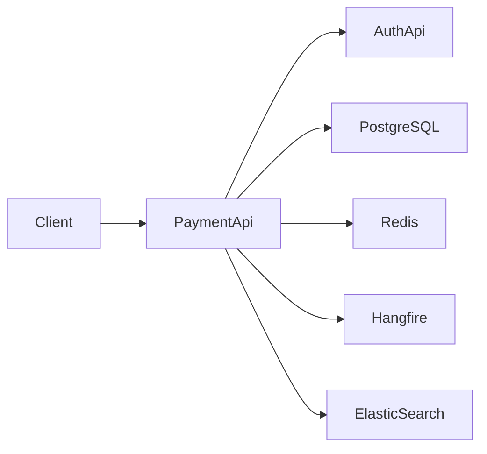
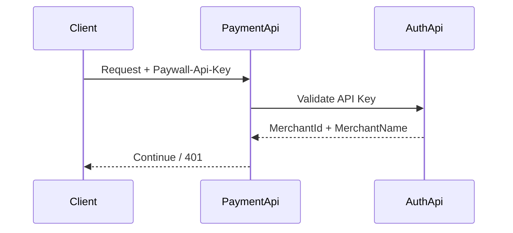
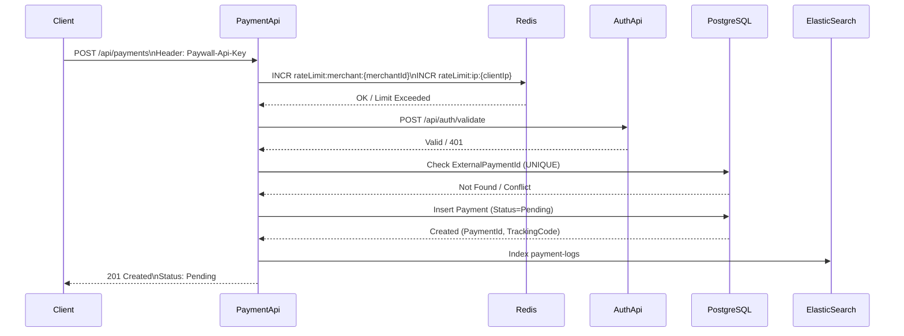
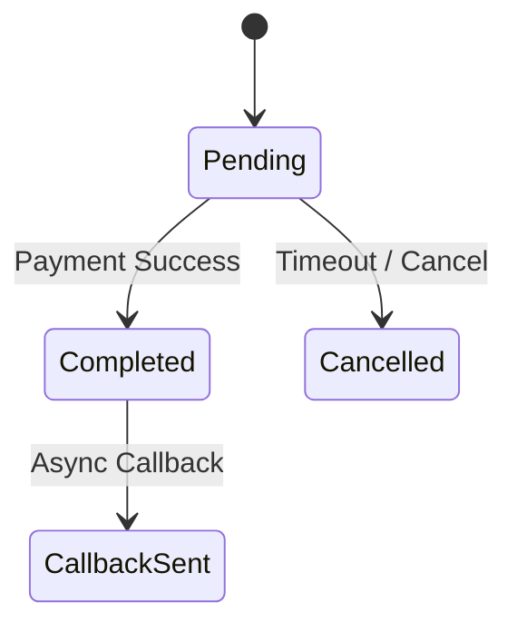

<h1 align="center">
<a href="https://github.com/kullanici-adi/paywall-project">
<picture>
<source height="125" media="(prefers-color-scheme: dark)" srcset="https://raw.githubusercontent.com/gofiber/docs/master/static/img/logo-dark.svg">

</picture>
</a>


Paywall Backend Case Project


<a href="#">

</a>
<a href="#">

</a>
<a href="#">

</a>
<a href="#">

</a>
<a href="#">

</a>
</h1>

<p align="center">
<em><b>Paywall</b>, farklı merchant'ların ödeme almasını sağlayan sadeleştirilmiş bir <b>ödeme işleme altyapısıdır</b>. Mühendislik yaklaşımını ve teknik karar alma süreçlerini  yansıtan bu proje; <b>AuthApi</b> ve <b>PaymentApi</b> olmak üzere iki ana servisten oluşur.</em>
</p>

## ⚙️ Installation (Kurulum)

Sistem **.NET 8** sürümünü gerektirir.Uygulamayı yerel makinenizde çalıştırmak için aşağıdaki adımları sırasıyla takip edin:

### 1. Repoyu Klonlayın
Öncelikle terminalinizi açın ve projeyi bilgisayarınıza indirin:
```bash
git clone [https://github.com/kullanici-adi/paywall-project.git](https://github.com/kullanici-adi/paywall-project.git)
```
İndirme tamamlandıktan sonra proje klasörüne giriş yapın:
```bash
cd paywall-project
```
### 2. Docker Compose ile Altyapıyı Başlatın
Aşağıdaki komut, docker-compose.yml dosyasındaki tüm bağımlılıkları (Veritabanı, Cache ve Log servisleri) otomatik olarak indirir ve yapılandırır:

```bash
docker-compose up-d
```

### 3. Veritabanı Şemasını Uygulayın
Konteynerlar ayağa kalktıktan sonra, PostgreSQL üzerinde tabloların oluşması için migration komutunu çalıştırın:

```bash
dotnet ef database update --project Paywall.Persistence
```
### 4. Servisleri Çalıştırın
Sistemdeki servisleri Docker üzerinden veya yerel terminalinizden başlatabilirsiniz:

Kimlik Doğrulama Servisi (AuthApi):
```bash
dotnet run --project ./Paywall.AuthApi
```
Ödeme İşlem Servisi (PaymentApi):
```bash
dotnet run --project ./Paywall.PaymentApi
```

## ⚡️ Quickstart (Kullanım)

Sistem ayağa kalktıktan sonra, aşağıdaki örnek isteği kullanarak bir ödeme oluşturabilir ve süreci test edebilirsiniz.

**Ödeme Oluşturma (POST):**
Not: Windows kullanıyorsanız komutu tek satırda ve tırnaklara dikkat ederek yazınız.
```bash
curl -X POST "http://localhost:5001/api/payments" -H "Paywall-Api-Key: secret_key_123" -H "Content-Type: application/json" -d "{\"amount\": 100.50, \"currency\": \"TRY\", \"merchantId\": 1, \"trackingCode\": \"TRK-001\", \"externalPaymentId\": \"EXT-001\"}"
```

## 💡 Technical Analysis (Aşama 1)
**📖 Overview**

Bu proje, sadeleştirilmiş bir ödeme işleme altyapısının analiz edilmesi, mimarisinin tasarlanması ve geliştirilmesi amacıyla hazırlanmıştır.

Sistem iki ayrı servis olarak tasarlanmıştır:

**AuthApi →** Merchant doğrulama servisi (stateless)

**PaymentApi →** Ödeme işleme ve sorgulama servisi

PaymentApi, gelen her istekte AuthApi’ye doğrulama çağrısı yaparak merchant bilgisini alır ve yalnızca geçerli istekleri işleme alır.

Bu tasarımın amacı:

Servis sorumluluklarını ayırmak

Authentication ile business logic’i izole etmek

Production senaryosunda yatay ölçeklenebilirliği kolaylaştırmak

**Architecture Summary**

<div align="center">

| Component     | Responsibility          | Scaling Strategy       |
| ------------- | ----------------------- | ---------------------- |
| AuthApi       | API Key doğrulama       | Stateless – Horizontal |
| PaymentApi    | Payment işlemleri       | Horizontal             |
| PostgreSQL    | Transactional Data      | Read Replica           |
| Redis         | Cache + Rate Limit      | Distributed            |
| Hangfire      | Background Jobs         | Worker Scaling         |
| ElasticSearch | Logging & Observability | Cluster                |
</div>

## 🏗 High-Level Architecture


## 🏗 Architectural Rationale (Mimari Yaklaşım)

Bu mimari aşağıdaki mühendislik prensipleri doğrultusunda tasarlanmıştır:

---

### • Separation of Concerns (Sorumlulukların Ayrılması)

- Authentication mekanizması business logic’ten izole edilmiştir.
- Cross-cutting concern’ler (logging, rate limiting, exception handling) middleware katmanında ele alınmıştır.
- Payment işlemleri yalnızca transactional domain logic’e odaklanmaktadır.

Amaç: Kodun sürdürülebilir, test edilebilir ve genişletilebilir olması.

---

### • Transactional Integrity (İşlemsel Tutarlılık)

- PostgreSQL sistemin tek doğruluk kaynağıdır (Single Source of Truth).
- Payment state değişimleri ACID garantisi altında gerçekleştirilir.
- `ExternalPaymentId` için UNIQUE constraint uygulanarak idempotency sağlanmıştır.

Amaç: Çift ödeme oluşturulmasının ve veri tutarsızlığının önlenmesi.

---

### • Scalability (Ölçeklenebilirlik)

- AuthApi stateless tasarlanmıştır.
- PaymentApi yatay ölçeklenebilir yapıdadır.
- Redis dağıtık cache ve rate limiting için kullanılmıştır.
- Hangfire worker sayısı artırılarak background job’lar ölçeklenebilir hale getirilmiştir.

Amaç: Artan trafik altında sistem performansının korunması.

---

### • Observability (Gözlemlenebilirlik)

- Structured logging uygulanmıştır.
- Request/Response logları ElasticSearch’e gönderilmektedir.
- PaymentId ve MerchantId üzerinden izlenebilirlik sağlanmıştır.

Amaç: Production ortamında hızlı hata analizi ve performans takibi.

---

### • Resilience (Dayanıklılık)

- Background job’larda retry mekanizması aktiftir.
- Timeout’a düşen `Pending` ödemeler otomatik olarak `Cancelled` durumuna alınır.
- Rate limiting ile kötüye kullanım engellenir.

Amaç: Sistem stabilitesinin korunması.


# 🔥 2️⃣ Box Layout (Daha Temiz ASCII)

```text
                 ┌───────────┐
                 │   Client  │
                 └─────┬─────┘
                       │
                       ▼
               ┌────────────────┐
               │   PaymentApi   │
               └─────┬─────┬────┘
                     │     │
          ┌──────────┘     └──────────┐
          ▼                            ▼
     ┌─────────┐                 ┌─────────────┐
     │ AuthApi │                 │ PostgreSQL  │
     └─────────┘                 └─────────────┘
          │                            │
          ▼                            ▼
     ┌─────────┐                 ┌─────────────┐
     │ Redis   │                 │ ElasticSearch│
     └─────────┘                 └─────────────┘
                     │
                     ▼
               ┌──────────┐
               │ Hangfire │
               └──────────┘
```


# 🔐 3. Authentication Flow


---

<div align="center">
    
### 🔎 Authentication Validation Steps

| Step | Action | Success Result | Failure Result |
|------|--------|---------------|----------------|
| 1 | Extract `Paywall-Api-Key` from Header | Continue | 401 Unauthorized |
| 2 | Validate API Key via AuthApi | Merchant context loaded | 401 Unauthorized |
| 3 | Inject MerchantId into Request Context | Request proceeds | - |

✔ AuthApi stateless tasarlanmıştır
✔ Session veya memory state tutulmaz
</div>

# 💳 Payment Creation Flow


2️⃣ Payment Creation Steps

<div align="center">

### 🔎 Payment Processing Steps

| Step | Action | Success Result | Failure Result |
|------|--------|---------------|----------------|
| 1 | Receive POST `/api/payments` | Continue | - |
| 2 | Increment rate limit counters (Redis) | Continue | 429 Too Many Requests |
| 3 | Validate `Paywall-Api-Key` via AuthApi | Merchant context loaded | 401 Unauthorized |
| 4 | Check `ExternalPaymentId` uniqueness | Continue | 409 Conflict |
| 5 | Insert Payment (Status = Pending) | Payment created | - |
| 6 | Log request/response to ElasticSearch | Log stored | Logging failure does not block |
| 7 | Return response | 201 Created | - |

</div>

3️⃣ Failure Scenarios

<div align="center">

### 🚨 Failure Cases

| Scenario | HTTP Status |
|----------|------------|
| Rate limit exceeded | 429 |
| Invalid API key | 401 |
| Duplicate ExternalPaymentId | 409 |

</div>

4️⃣ Design Guarantees

<div align="center">

### 🔐 Design Guarantees

- Rate limiting doğrulama öncesinde uygulanır (kötüye kullanım önlenir)
- API doğrulaması stateless’tir
- `ExternalPaymentId` veritabanı seviyesinde UNIQUE constraint ile korunur
- Başlangıç ödeme durumu her zaman `Pending` olarak atanır
- Logging işlemi business akışını bloklamaz

</div>

# 🔄 5. Payment State Lifecycle

🔥 1️⃣ State Transition Kuralları Ekleyelim

<div align="center">

### 🔄 Durum Geçiş Kuralları

| From | To | Koşul |
|------|----|--------|
| Pending | Completed | Başarılı ödeme sonucu |
| Pending | Cancelled | Timeout (>30dk) veya manuel iptal |
| Completed | CallbackSent | Callback job başarıyla tamamlandı |

Geçersiz geçişler engellenmiştir (örneğin Completed → Pending mümkün değildir).

</div>

🔥 2️⃣ Invalid Transition Protection (Çok Güçlü)

### 🛑 Geçersiz Geçiş Koruması

- Durum değişimleri kontrollüdür.
- State transition işlemleri atomic olarak gerçekleştirilir.
- Aynı anda iki farklı güncelleme yapılması engellenir.

🔥 3️⃣ Concurrency Notu (Senior Dokunuş)

### ⚙️ Concurrency Kontrolü

- Status güncellemeleri optimistic locking prensibine uygundur.
- Tekil payment kaydı üzerinden deterministik geçiş sağlanır.
- Çift tamamlama (double completion) engellenmiştir.

🔥 4️⃣ Lifecycle Diyagramını Biraz Zenginleştirelim



🔥 5️⃣ Business Guarantee Bölümü (En Güçlü Ek)

### 🧾 İş Kuralları Garantisi

- Bir ödeme yalnızca bir kez `Completed` olabilir.
- `Cancelled` durumuna geçmiş bir ödeme tekrar aktif hale getirilemez.
- Callback yalnızca `Completed` durumundan sonra tetiklenir.


# 🚦 7. Rate Limiting Strategy
<div align="center">

| Type           | Key        | Implementation |
| -------------- | ---------- | -------------- |
| Merchant-based | merchantId | Redis counter  |
| IP-based       | IP Address | Redis counter  |

</div>

# 🛡 10. Middleware Architecture

PaymentApi Middleware Pipeline:
<div align="center">
    
| Middleware         | Purpose                  |
| ------------------ | ------------------------ |
| Authentication     | API key validation       |
| Exception Handling | Global error handling    |
| Rate Limiting      | Abuse protection         |
| Logging            | Request/Response logging |
| Response Wrapper   | Standard output          |

</div>

# 🏭 11. Production Enhancements
<div align="center">
    
| Area        | Improvement          |
| ----------- | -------------------- |
| Security    | API Gateway, mTLS    |
| Scalability | Kubernetes           |
| Reliability | Circuit Breaker      |
| Consistency | Outbox Pattern       |
| Monitoring  | Prometheus + Grafana |
</div>

# 🎯 13. Engineering Decisions Summary
<div align="center">
    
| Concern       | Approach          |
| ------------- | ----------------- |
| Idempotency   | Unique constraint |
| Scalability   | Stateless auth    |
| Performance   | Redis cache       |
| Observability | ElasticSearch     |
| Reliability   | Hangfire retry    |

</div>
